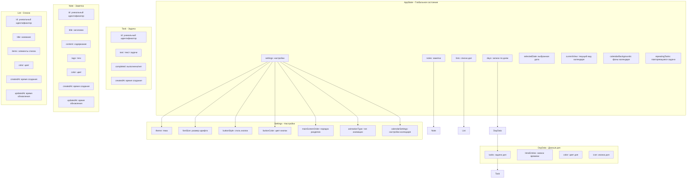

# Архитектурная диаграмма Calendar_Pro_Notte

## Общая архитектура системы

```mermaid
graph TB
    %% Слой представления
    subgraph "Слой представления (UI Layer)"
        App[App.tsx - Главный компонент]
        MainScreen[MainApp - Главный экран]
        Calendar[CalendarView - Календарь]
        Notes[NotesView - Заметки]
        Lists[ListsView - Списки]
        Settings[SettingsView2 - Настройки]
        Lock[LockScreen - Экран блокировки]
    end

    %% Компоненты календаря
    subgraph "Компоненты календаря"
        CalSettings[CalendarSettingsView]
        YearView[YearView - Вид года]
        MonthView[MonthView - Вид месяца]
        WeekView[WeekView - Вид недели]
        DayDetail[DayDetailView - Детали дня]
    end

    %% Общие компоненты
    subgraph "Общие компоненты"
        AlertDialog[AlertDialog - Диалоги]
        SharedComponents[Другие общие компоненты]
    end

    %% Слой состояния
    subgraph "Слой управления состоянием"
        AppContext[AppContext - Глобальное состояние]
        Reducer[appReducer - Редьюсер]
        Actions[AppAction - Действия]
    end

    %% Утилиты
    subgraph "Утилиты"
        CalendarUtils[calendarUtils.ts]
    end

    %% Хранилище данных
    subgraph "Хранилище данных"
        LocalStorage[localStorage]
        AppData[calendar-app-data]
        Settings2[calendar-settings]
        Backgrounds[section-backgrounds]
    end

    %% Внешние библиотеки
    subgraph "Внешние библиотеки"
        React[React 18]
        FramerMotion[Framer Motion]
        Lucide[Lucide Icons]
        Tailwind[Tailwind CSS]
    end

    %% Связи
    App --> MainScreen
    App --> AppContext
    MainScreen --> Calendar
    MainScreen --> Notes
    MainScreen --> Lists
    MainScreen --> Settings
    MainScreen --> Lock

    Calendar --> CalSettings
    Calendar --> YearView
    Calendar --> MonthView
    Calendar --> WeekView
    Calendar --> DayDetail

    Notes --> AlertDialog
    Lists --> AlertDialog
    Settings --> AlertDialog

    AppContext --> Reducer
    AppContext --> Actions
    AppContext --> LocalStorage

    CalendarUtils --> MonthView
    CalendarUtils --> WeekView
    CalendarUtils --> YearView

    LocalStorage --> AppData
    LocalStorage --> Settings2
    LocalStorage --> Backgrounds

    App --> React
    MainScreen --> FramerMotion
    Calendar --> FramerMotion
    Notes --> Lucide
    Lists --> Lucide
    Settings --> Lucide
```



## Архитектура настроек системы

```mermaid
graph TB
    %% Главные настройки
    subgraph "Система настроек"
        MainSettings[SettingsView2 - Главные настройки]
        CalendarSettings[CalendarSettingsView - Настройки календаря]
        LegacySettings[SettingsView - Устаревшие настройки]
    end

    %% Категории настроек
    subgraph "Категории настроек SettingsView2"
        Theme[Тема: светлая/тёмная]
        FontSize[Размер шрифта: маленький/средний/большой]
        ButtonStyle[Стиль кнопок: скруглённые/квадратные/круглые/октагон]
        ButtonColor[Цвет кнопок: палитра цветов]
        SectionOrder[Порядок разделов: drag&drop]
        SectionBg[Фон разделов: картинки/градиенты]
        DataManagement[Управление данными: экспорт/импорт/очистка]
        Statistics[Статистика: задачи/заметки/списки]
        LockSettings[Блокировка: PIN/биометрия]
    end

    %% Настройки календаря
    subgraph "Настройки календаря CalendarSettingsView"
        TaskSorting[Сортировка задач по времени]
        RepeatingTasks[Повторяющиеся задачи]
        Reminders[Локальные уведомления]
        CalendarAppearance[Внешний вид календаря]
        DayHighlight[Выделение дня: форма/цвет]
        CalendarBg[Фон календаря: год/месяц/неделя]
        Animations[Анимации переходов]
    end

    %% Хранилище настроек
    subgraph "Хранилище настроек"
        AppContextSettings[AppContext.settings]
        LocalStorageMain[localStorage: main-settings]
        LocalStorageCalendar[localStorage: calendar-settings]
        LocalStorageBg[localStorage: section-backgrounds]
        LocalStorageReminders[localStorage: calendar-reminders]
    end

    %% Связи настроек
    MainSettings --> Theme
    MainSettings --> FontSize
    MainSettings --> ButtonStyle
    MainSettings --> ButtonColor
    MainSettings --> SectionOrder
    MainSettings --> SectionBg
    MainSettings --> DataManagement
    MainSettings --> Statistics
    MainSettings --> LockSettings

    CalendarSettings --> TaskSorting
    CalendarSettings --> RepeatingTasks
    CalendarSettings --> Reminders
    CalendarSettings --> CalendarAppearance
    CalendarSettings --> DayHighlight
    CalendarSettings --> CalendarBg
    CalendarSettings --> Animations

    MainSettings --> AppContextSettings
    CalendarSettings --> AppContextSettings
    
    Theme --> LocalStorageMain
    FontSize --> LocalStorageMain
    ButtonStyle --> LocalStorageMain
    ButtonColor --> LocalStorageMain
    SectionOrder --> LocalStorageMain
    
    SectionBg --> LocalStorageBg
    CalendarSettings --> LocalStorageCalendar
    Reminders --> LocalStorageReminders
```



## Структура данных и состояние



## Функциональная архитектура настроек

```mermaid
graph LR
    %% Пользователь
    User[Пользователь] 

    %% Экраны настроек
    subgraph "Экраны настроек"
        MainSettingsScreen[Главные настройки<br/>SettingsView2]
        CalendarSettingsScreen[Настройки календаря<br/>CalendarSettingsView]
    end

    %% Функции главных настроек
    subgraph "Функции главных настроек"
        AppearanceSettings[Настройки внешнего вида<br/>- Тема<br/>- Размер шрифта<br/>- Стиль кнопок<br/>- Цвет кнопок]
        
        LayoutSettings[Настройки макета<br/>- Порядок разделов (drag&drop)<br/>- Фон разделов<br/>- Градиенты и изображения]
        
        DataSettings[Управление данными<br/>- Экспорт в JSON<br/>- Импорт данных<br/>- Очистка всех данных<br/>- Статистика]
        
        SecuritySettings[Безопасность<br/>- Установка PIN<br/>- Смена PIN<br/>- Биометрия<br/>- Сброс блокировки]
    end

    %% Функции настроек календаря
    subgraph "Функции настроек календаря"
        TaskSettings[Настройки задач<br/>- Автосортировка по времени<br/>- Повторяющиеся задачи<br/>- Drag&drop задач]
        
        NotificationSettings[Уведомления<br/>- Локальные напоминания<br/>- Время и текст<br/>- Управление напоминаниями]
        
        VisualSettings[Визуальные настройки<br/>- Форма выделения дня<br/>- Цвет выделения<br/>- Фон календаря<br/>- Анимации переходов]
        
        RepeatTaskSettings[Повторяющиеся задачи<br/>- Еженедельные<br/>- Ежемесячные<br/>- Ежегодные<br/>- Иконки и цвета]
    end

    %% Хранение данных
    subgraph "Система хранения"
        GlobalContext[Глобальный контекст<br/>AppContext]
        LocalStorageSystem[localStorage<br/>- calendar-app-data<br/>- calendar-settings<br/>- section-backgrounds<br/>- calendar-reminders]
    end

    %% Применение настроек
    subgraph "Применение настроек"
        UIUpdates[Обновление UI<br/>- Темы<br/>- Шрифты<br/>- Стили кнопок]
        
        LayoutUpdates[Обновление макета<br/>- Порядок компонентов<br/>- Фоны разделов]
        
        FunctionalUpdates[Функциональные обновления<br/>- Сортировка задач<br/>- Анимации<br/>- Уведомления]
    end

    %% Связи
    User --> MainSettingsScreen
    User --> CalendarSettingsScreen
    
    MainSettingsScreen --> AppearanceSettings
    MainSettingsScreen --> LayoutSettings
    MainSettingsScreen --> DataSettings
    MainSettingsScreen --> SecuritySettings
    
    CalendarSettingsScreen --> TaskSettings
    CalendarSettingsScreen --> NotificationSettings
    CalendarSettingsScreen --> VisualSettings
    CalendarSettingsScreen --> RepeatTaskSettings
    
    AppearanceSettings --> GlobalContext
    LayoutSettings --> LocalStorageSystem
    DataSettings --> LocalStorageSystem
    SecuritySettings --> LocalStorageSystem
    
    TaskSettings --> GlobalContext
    NotificationSettings --> LocalStorageSystem
    VisualSettings --> GlobalContext
    RepeatTaskSettings --> GlobalContext
    
    GlobalContext --> UIUpdates
    LocalStorageSystem --> LayoutUpdates
    GlobalContext --> FunctionalUpdates
```

## Ключевые особенности архитектуры

### 1. **Архитектура состояния**
- **Централизованное управление**: Использует React Context + useReducer
- **Персистентность**: Автоматическое сохранение в localStorage
- **Типизация**: Полная типизация состояния с TypeScript

### 2. **Компонентная архитектура**
- **Модульность**: Четкое разделение по функциональности
- **Переиспользование**: Общие компоненты (AlertDialog, shared components)
- **Изоляция**: Каждый вид имеет свои настройки и состояние

### 3. **Система настроек**
- **Двухуровневая структура**: Глобальные настройки + настройки календаря
- **Множественное хранение**: Разные localStorage ключи для разных типов данных
- **Интерактивность**: Drag&drop, color picker, живое предпросмотр

### 4. **Безопасность**
- **PIN-блокировка**: Локальное хранение PIN
- **Биометрия**: Поддержка WebAuthn API
- **Экспорт/Импорт**: Защищенный обмен данными

### 5. **Производительность**
- **Анимации**: Framer Motion для плавных переходов
- **Ленивая загрузка**: Компоненты загружаются по требованию
- **Оптимизация рендеринга**: useEffect и мемоизация

Эта архитектура обеспечивает масштабируемость, поддерживаемость и отличный пользовательский опыт для календарного приложения.